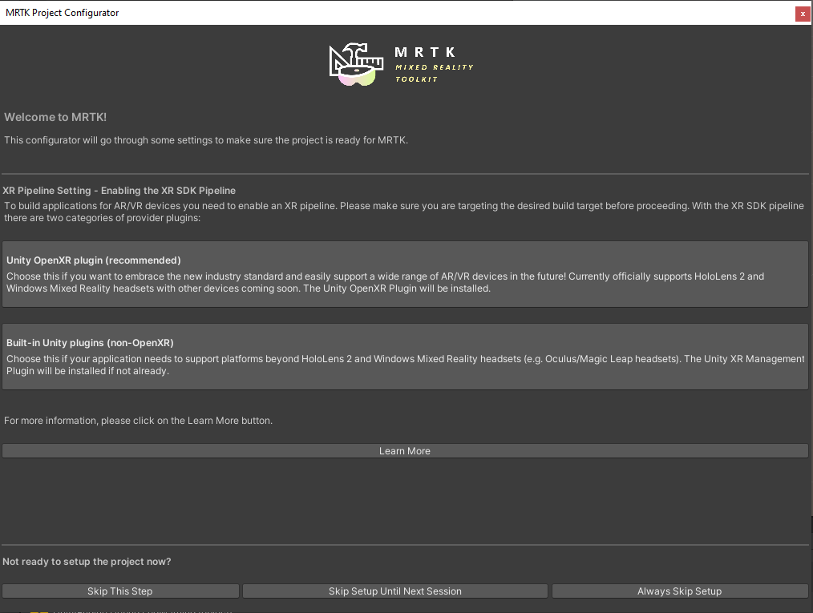
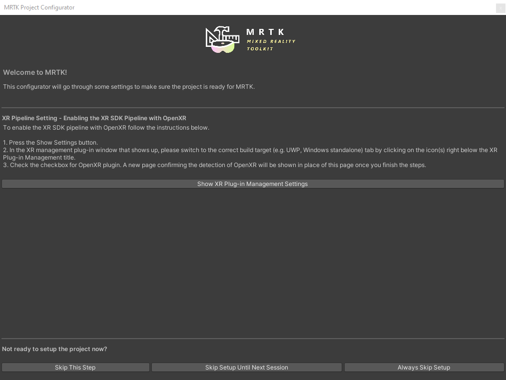
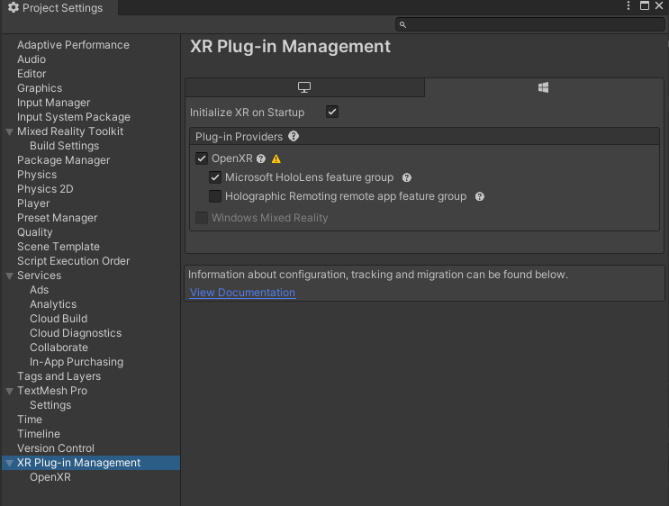

# MR-Lab

Our teams project of the [MR Lab](http://www.cvg.ethz.ch/teaching/mrlab/) at ETH Zürich.

Algorithm based on the tutorial from [Eric Schubert on youtube](https://www.youtube.com/playlist?list=PLm9r3VWwsENF8Cmjdj_9aZhpiYj5fzdYG).

## Usage

### Prerequisites

* Unity 2020.3.20f1 installed
* Visual Studio 2019 installed
* Basic Understanding of Unity

### Clone repo

Clone the repo to a location on your computer, either by usign git or directly downloading the codebase in a ZIP file using the green CODE button on github.

### Configuring Unity

Open Unity Hub and add the project. Open the project and wait for Unity to load the project.

Once Unity opens the project, you should see the configuration prompt for the MRTK:

Click the button **Unity OpenXR plugin (recommended)** and wait for Unity to setup the project.

Once Unity finishes, the next screen in the MRTK setup opens:

Click on the **Show XR Plug-in Management Settings** button and make sure that in the tab with the windows logo, the following two checkboxes are activated:

If this is the case, you may close the MRTK configuration. Now we need to reconfigure the Unity Project for the hololens.

More detailed instructions on how to use the MRTK configuration can be found [on the documentation pages from Microsoft](https://docs.microsoft.com/en-us/learn/modules/learn-mrtk-tutorials/1-5-exercise-configure-resources).

Click on `File > Build Settings`, and select Universal Windows Platform and complete these settings:

* Set Target device to HoloLens
* Set Architecture to ARM 64
* Set Build Type to D3D Project
* Set Target SDK Version to Latest Installed
* Set Minimum Platform Version to 10.0.10240.0
* Set Visual Studio Version to Latest installed
* Set Build and Run on to USB Device
* Set Build configuration to Release (there are known performance issues with Debug)

More detailed instructions on how to configure unity for MRTK projects can be found [on the documentation pages from Microsoft](https://docs.microsoft.com/en-us/learn/modules/learn-mrtk-tutorials/1-3-exercise-configure-unity-for-windows-mixed-reality).

### Build the project

After configuring the project in unity, open `File > Build Settings`, activate the `Universal Windows Platform` tab and click on `Build`. Select a folder where to put the build files and let unity build the project.
After unity finished building the project, the file explorer will open. Double click on the `.sln` file to open the project in visual studio.

To deploy the app on the hololens, follow [the instructions on the Microsoft website](https://docs.microsoft.com/en-us/windows/mixed-reality/develop/advanced-concepts/using-visual-studio?tabs=hl2#build-configuration). Please note that if you want to deploy the app over WiFi to the hololens, you [first need to configure Visual studio to connect to the hololens](https://docs.microsoft.com/en-us/windows/mixed-reality/develop/advanced-concepts/using-visual-studio?tabs=hl2#remote-connection).
